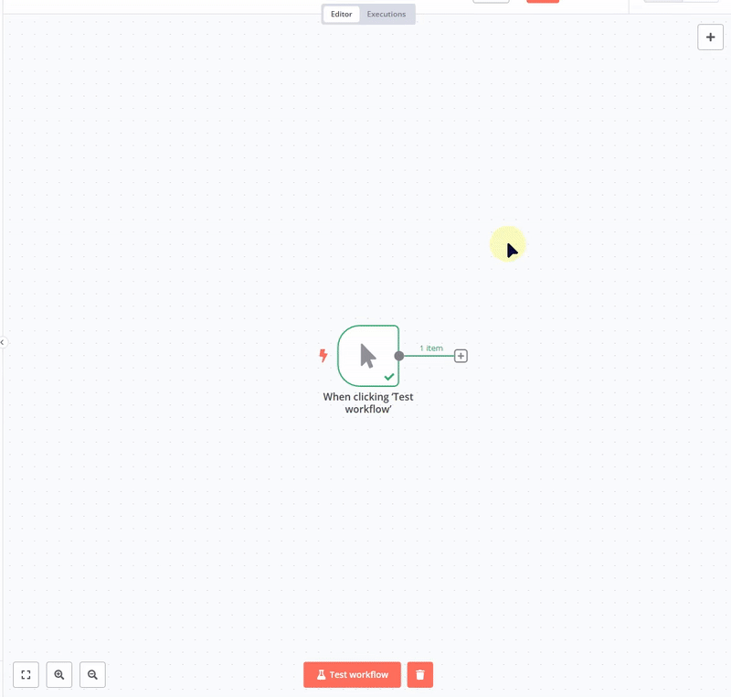

# n8n-nodes-exchangerate-api


[](https://buymeacoffee.com/msoukhomlinov)

This is an n8n community node for the [ExchangeRate API](https://www.exchangerate-api.com). It provides a simple way to get currency exchange rates and perform conversions within your n8n workflows.

[n8n](https://n8n.io/) is a [fair-code licensed](https://docs.n8n.io/reference/license/) workflow automation platform.

[Installation](#installation)  
[Credentials](#credentials)  
[Operations](#operations)  
[Features](#features)  
[Resources](#resources)  
[Contributing](#contributing)  
[Support](#support)  
[License](#license)  

## Usage Preview



## Installation

Follow the [installation guide](https://docs.n8n.io/integrations/community-nodes/installation/) in the n8n community nodes documentation.

### Using n8n Desktop and GUI

1. Go to **Settings > Community Nodes**
2. Enter `n8n-nodes-exchangerate-api` in the "Enter npm package name" field
3. Click "Install"
4. After installation, you'll find the "ExchangeRate API" node in the node library

### Using npm

```bash
npm install n8n-nodes-exchangerate-api
```

## Credentials

This node requires an API key from ExchangeRate API. You can get a free API key by [signing up](https://www.exchangerate-api.com/).

To use this node, you need to:
1. Create an account at ExchangeRate API
2. Obtain your API key
3. Configure the node with the API key using Token Bearer Authentication

## Operations

This node supports the following operations:

### Get Exchange Rates

Fetches the latest exchange rates from a base currency (e.g., USD) to all other supported currencies.

**Parameters:**
- **Resource**: Exchange Rate (default)
- **Base Currency**: Select a currency from the dropdown of ISO 4217 currency codes (e.g., USD, EUR, GBP)

### Convert Value

Converts a value from one currency to another.

**Parameters:**
- **Resource**: Exchange Rate (default)
- **Amount**: The amount to convert (must be positive)
- **From Currency**: Select a currency from the dropdown of ISO 4217 currency codes
- **To Currency**: Select a currency from the dropdown of ISO 4217 currency codes
- **Use Conversion Fee**: Toggle to enable/disable applying a percentage fee
  - **Conversion Fee (%)**: Percentage fee to add to the conversion (only shown when toggle is enabled)
- **Use Decimal Places**: Toggle to enable/disable rounding to specific decimal places
  - **Decimal Places**: Number of decimal places to round the result to (only shown when toggle is enabled, must be a non-negative integer)
- **Return Detailed Response**: Toggle to switch between detailed or simple response format
  - When enabled (default): Returns full conversion details including rates, fee, and timestamps
  - When disabled: Returns only the converted amount value

## Features

- Simple and intuitive interface for currency exchange operations
- Support for all major currencies (ISO 4217 codes)
- Configurable conversion fees for financial calculations
- Flexible decimal place settings for precise outputs
- Choice between detailed or simplified response formats
- Reliable and up-to-date exchange rate data

## Resources

* [n8n community nodes documentation](https://docs.n8n.io/integrations/community-nodes/)
* [ExchangeRate API documentation](https://www.exchangerate-api.com/docs/overview)
* [GitHub Repository](https://github.com/msoukhomlinov/n8n-nodes-exchangerate-api)

## Contributing

Contributions are welcome! If you'd like to contribute to this project:

1. Fork the repository
2. Create a feature branch (`git checkout -b feature/AmazingFeature`)
3. Commit your changes (`git commit -m 'Add some AmazingFeature'`)
4. Push to the branch (`git push origin feature/AmazingFeature`)
5. Open a Pull Request

For bug reports or feature requests, please use the GitHub issues section.

## Support

If you find this node helpful and would like to support its development:

[](https://buymeacoffee.com/msoukhomlinov)

## License

[MIT](LICENSE.md)
